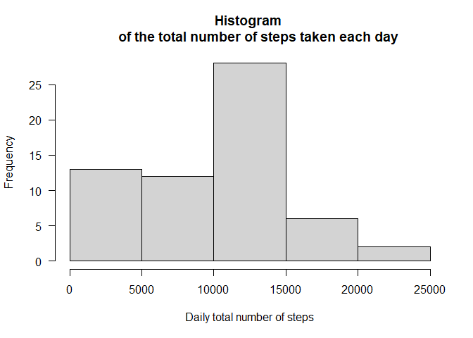
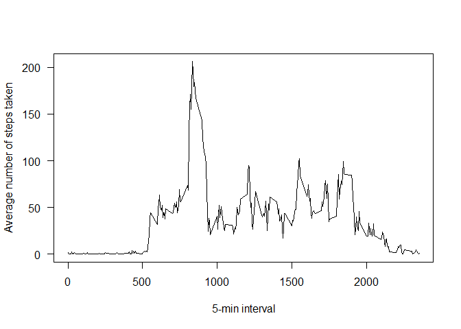
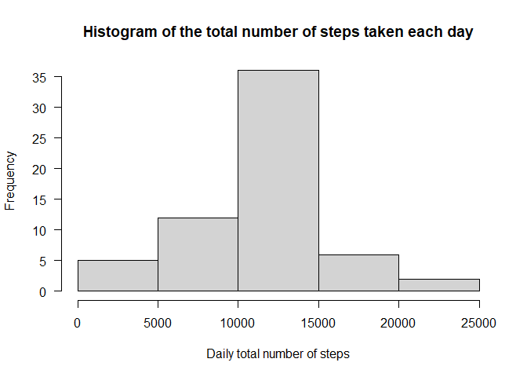
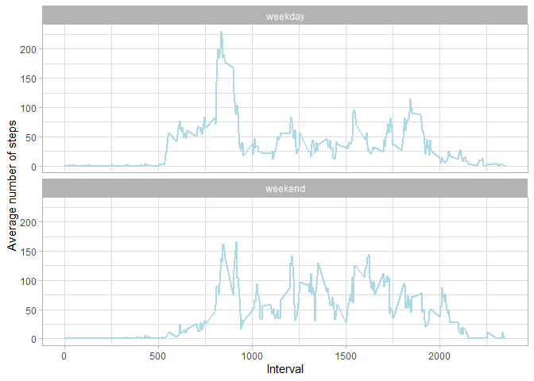

This document reports the answers to the questions of the assignment


## Loading and preprocessing the data

1. Unzip the data zip file 

```r
unzip("activity.zip")
```

2. Load the data csv file and show first rows

```r
data <- read.csv("activity.csv")
head(data)
```

```
##   steps       date interval
## 1    NA 2012-10-01        0
## 2    NA 2012-10-01        5
## 3    NA 2012-10-01       10
## 4    NA 2012-10-01       15
## 5    NA 2012-10-01       20
## 6    NA 2012-10-01       25
```

3. Convert variable `date` to date format

```r
data$date <- as.Date(data$date)
```


## What is mean total number of steps taken per day?

1. Calculate the total number of steps taken per day and show first rows

```r
library(dplyr)
steps_day <- data %>% group_by(date) %>% 
      summarize(total_steps=sum(steps, na.rm = TRUE))
head(steps_day)
```

```
## # A tibble: 6 x 2
##   date       total_steps
##   <date>           <int>
## 1 2012-10-01           0
## 2 2012-10-02         126
## 3 2012-10-03       11352
## 4 2012-10-04       12116
## 5 2012-10-05       13294
## 6 2012-10-06       15420
```

2. Make a histogram of the total number of steps taken each day

```r
hist(steps_day$total_steps, xlab="Daily total number of steps", main="Histogram 
     of the total number of steps taken each day", las=1)
```

<!-- -->

3. Calculate and report the mean and median of the total number of steps taken 
per day

```r
mean_steps <- mean(steps_day$total_steps, na.rm = TRUE)
median_steps <- median(steps_day$total_steps, na.rm = TRUE)
```

The **mean** of the total number of steps taken per day is **9354.2295082** 
and the **median** is **10395**

## What is the average daily activity pattern?

1. Make a time series plot of the 5-minute interval (x-axis) and the average 
number of steps taken, averaged across all days (y-axis)

```r
interval_data <- data %>% group_by(interval) %>% 
      summarize(avg_steps=mean(steps, na.rm=TRUE))
plot(interval_data$interval, interval_data$avg_steps, type='l', 
     xlab='5-min interval', ylab='Average number of steps taken', las=1)
```

<!-- -->

2.Which 5-minute interval, on average across all the days in the dataset, 
contains the maximum number of steps?

```r
max_steps <- which.max(interval_data$avg_steps)
```

On average across all the days in the dataset, the **5-min interval** 
that contains the maximum number of steps is **104**


## Imputing missing values

1.Calculate and report the total number of missing values in the dataset

```r
nb_na <- sum(is.na(data$steps))
```

The **total number of missing values** in the dataset is **2304**

2. Fill in all of the missing values in a new dataset using the mean for that 
5-minute interval and show first rows of imputed data

```r
complete_data <- data
index <- which(is.na(complete_data$steps))
for (i in index){
   complete_data$steps[i] <- interval_data$avg_steps[
      interval_data$interval == complete_data$interval[i]]
}

head(complete_data[index,])
```

```
##       steps       date interval
## 1 1.7169811 2012-10-01        0
## 2 0.3396226 2012-10-01        5
## 3 0.1320755 2012-10-01       10
## 4 0.1509434 2012-10-01       15
## 5 0.0754717 2012-10-01       20
## 6 2.0943396 2012-10-01       25
```

3. Make a histogram of the total number of steps taken each day

```r
complete_steps_day <- complete_data %>% group_by(date) %>%
      summarize(total_steps = sum(steps))
hist(complete_steps_day$total_steps, xlab="Daily total number of steps", 
main="Histogram of the total number of steps taken each day", las=1)
```

<!-- -->

4. Calculate and report the mean and median total number of steps taken per day

```r
mean_complete_steps <- mean(complete_steps_day$total_steps)
median_complete_steps <- median(complete_steps_day$total_steps)
```

The **mean** of the total number of steps taken per day is 
**1.0766189\times 10^{4}** and the **median** is 
**1.0766189\times 10^{4}**

5. Do these values differ from the estimates from the first part of the 
assignment?

```r
if (mean_steps == mean_complete_steps){
   print('Both means are equal')
}else{ print('Both means differ')}
```

```
## [1] "Both means differ"
```

```r
if (median_steps == median_complete_steps){
   print('Both medians are equal')
}else{print('Both medians differ')}
```

```
## [1] "Both medians differ"
```

6. What is the impact of imputing missing data on the estimates of the total 
daily number of steps?

Imputing missing data on the estimates of the total daily number of steps 
impact on the validity of the total daily number. The resulting number does not
reflect the reality.


## Are there differences in activity patterns between weekdays and weekends?

1. Create a new factor variable in the dataset with two levels – “weekday” and
“weekend” indicating whether a given date is a weekday or weekend day.


```r
weekend_labels <- c("Saturday", "Sunday")
complete_data$weekdays <- factor((weekdays(complete_data$date)
                                  %in% weekend_labels) , 
                                  levels = c(FALSE, TRUE), 
                                  labels = c("weekday", "weekend"))
```

2. Make a panel plot containing a time series plot of the 5-minute interval 
(x-axis) and the average number of steps taken, averaged across all weekday days
or weekend days (y-axis). 


```r
interval_complete_data <- complete_data %>% group_by(weekdays, interval) %>% summarize(avg_steps=mean(steps))

library(ggplot2)
ggplot(data=interval_complete_data, aes(x=interval, y=avg_steps))+
   geom_line(color="lightblue", size=1)+
   facet_wrap(~weekdays, nrow=2)+
   labs(x='Interval', y='Average number of steps')+
   theme_light()
```

<!-- -->
